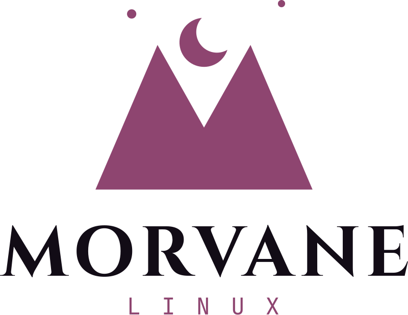
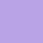
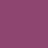
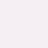

<p align="center">
  <picture>
    <source media="(prefers-color-scheme: dark)" srcset="png/lockup-stacked-dark.png">
    
  </picture>
</p>

# MorvaneOS brand assets

The MorvaneOS logo, colours and type, in every format the distro and its
projects need. **Twilight Peaks**: two peaks forming an **M**, with a crescent
moon rising between them. The name comes from *Twilight*, so the palette is
pastel goth: dusty pink and lavender on a purple-black night.

Everything in `svg/`, `png/` and `ascii/` is generated by
[`tools/build.py`](tools/build.py) from a single definition of the logo. Edit
the script, not the output files.

## Colours

| | Name | Hex | RGB | Use |
|---|---|---|---|---|
|  | **Pastel Pink** | `#F4A6C6` | 244, 166, 198 | Primary. The mark, highlights and accents on dark backgrounds |
|  | **Lavender** | `#B9A3E6` | 185, 163, 230 | Secondary. The moon and stars, the *LINUX* line on dark, links |
|  | **Rose** | `#8E4570` | 142, 69, 112 | The mark and accents on light backgrounds |
|  | **Night** | `#120C16` | 18, 12, 22 | Dark backgrounds; text on light |
|  | **Paper** | `#F5EEF3` | 245, 238, 243 | Light backgrounds |

Contrast (WCAG): Pastel Pink on Night 10.2:1, Lavender on Night 8.7:1,
Rose on Paper 5.7:1, Night on Paper 16.9:1, Night on Pastel Pink 10.2:1.

**Never put Pastel Pink on a light background** (1.7:1 on Paper: it nearly
disappears). Use Rose there; that's what the `light` and `rose` files do.

For terminals and `os-release`: `ANSI_COLOR="38;2;244;166;198"`.

## Type

| Role | Typeface | Weight |
|---|---|---|
| Wordmark, headings | [Cinzel](https://fonts.google.com/specimen/Cinzel) | Bold (700); Medium (500) for "Linux" in the one-line lockup |
| *LINUX* line, code, terminal, small labels | [JetBrains Mono](https://fonts.google.com/specimen/JetBrains+Mono) | Regular (400), widely letter-spaced |

Both are under the SIL Open Font License. In the SVGs the lettering is
converted to outlines, so no font needs to be installed to display them.

## Files

### The mark

| File | For |
|---|---|
| `svg/mark-pastel.svg` | Dark backgrounds (full colour: pink peaks, lavender moon and stars) |
| `svg/mark-rose.svg` | Light backgrounds |
| `svg/mark-night.svg`, `svg/mark-white.svg` | One colour, e.g. stamped on hardware, merch, monochrome UI |
| `svg/favicon-*.svg` | 48 px and smaller: just the peaks, since the moon and stars turn into specks |

PNGs of each at 64, 128, 256, 512 and 1024 px (`png/mark-pastel-256.png`),
favicons at 16, 32 and 48 px.

### Lockups (mark + name)

| File | Looks like | For |
|---|---|---|
| `lockup-horizontal-{light,dark}` | Mark, then **Morvane** over *L I N U X* | Default: READMEs, websites, docs |
| `lockup-stacked-{light,dark}` | Mark above **MORVANE** / *L I N U X* | Splash screens, the ISO, square spaces, avatars |
| `lockup-oneline-{light,dark}` | Mark · **Morvane** \| Linux | Narrow headers, footers, banners |

`light` = for light backgrounds, `dark` = for dark ones. In `svg/`, and in
`png/` at 800 px wide plus `@2x` at 1600 px. Transparent backgrounds.

### App icon

`app-icon-light` (Night mark on Pastel Pink) and `app-icon-dark` (full-colour
mark on Night): rounded squares, in `svg/` and as PNGs from 64 to 1024 px.

### Terminal art (`ascii/`)

```
       ▄                             ▀
      ▀▀            ▄
                  ███
                 ████
            ▄    ████▄▄        ▄
           ▄██    ████████    ██▄
          ▄████     ▀▀▀▀     ████▄
          ██████▄          ▄██████
         ████████▄        ▄████████
        ██████████▄      ▄██████████
       ████████████▄    ▄████████████
      ▄█████████████▄  ▄█████████████▄
     ▄████████████████████████████████▄
    ▄██████████████████████████████████▄
    ████████████████████████████████████
   ██████████████████████████████████████
  ████████████████████████████████████████
 ██████████████████████████████████████████
▄██████████████████████████████████████████▄
```

| File | Format |
|---|---|
| `morvane.txt` | fastfetch logo format: `$1` = Pastel Pink, `$2` = Lavender |
| `morvane-plain.txt` | No colour codes |
| `morvane.ans` | Truecolour escape codes: `cat ascii/morvane.ans` to preview |

Needs a font with the block characters `█ ▀ ▄` (every common terminal font has
them).

## Using the logo

- Keep clear space around it of at least the height of the moon.
- Don't recolour it outside the palette, stretch it, add effects, or put the
  full-colour mark on a busy background. Use a one-colour version instead.
- The name is **MorvaneOS**; in full, **MorvaneOS Linux**. The logo lockups
  read *Morvane / Linux*.

## Rebuilding

Needs Python 3 with `fonttools`, `uharfbuzz` and `pillow`, and `rsvg-convert`
(librsvg):

```
pip install fonttools uharfbuzz pillow
python tools/build.py
```

The fonts are downloaded to `tools/.cache/` on first run.

## License

TODO: choose a license for the MorvaneOS logo and brand assets.
